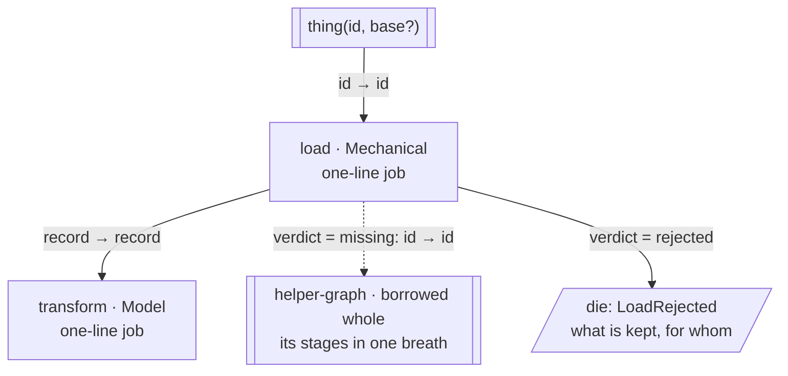

# Graph mermaid notation

The grammar behind every mermaid vision: what a box, an edge, a condition and a death mean. One
node per step in the run's data flow, edges as output-to-input field mappings, conditions written
on the edges they fire.

## Notation

Boundary nodes and borrowed graphs are subroutine boxes (`[[ ]]`), steps are plain boxes carrying their name, one-line job and `Mechanical`/`Model` type, deaths are terminals (`[/ /]`) stating what dies and what is kept. Solid edges carry the path a green run takes — including a conditional forward exit, which stays solid but still names its firing value. Dotted edges are the departures from that path: loops, retries, escalations, deaths. A label ending in `→ (gate)` names a field that authorizes progress but is consumed by no downstream input.

## What counts as one node

One step in the run's data flow, any size. A graph borrowed whole is one box — its inner nodes are its own vision's business, never re-drawn here. A loop is its body plus a dotted feedback edge whose label carries the trigger and the bound. Regions group as subgraphs, and a subgraph's label states its relationship to its siblings (parallel, loop, condition) rather than just naming it.

## Grammar rules

- Draw the artifact, never instructions about the artifact. Prose around the diagram earns its place only by stating something the notation cannot carry.
- Label every edge as a field mapping, `output → input`, never a sentence. If an edge has no field to carry, question the edge.
- Name on every conditional edge the field and the value that fires it (`verdict = findings: findingsPath → findingsPath`), whether the edge is solid (the green run's forward exit) or dotted (a departure). A condition the reader can't resolve from the diagram itself — a bare requirement or ticket ID — doesn't count as named.
- Give every step node its one-line job and its `Mechanical`/`Model` type; a reader should know what each box costs and what it decides without opening anything.
- Draw every death as a terminal stating what error it dies with and what survives it (a kept worktree, a written artifact).
- When the drawing surfaces something undecided — a bound's value, a field with no producer — flag it in one line under the diagram as a gap needing a ruling, instead of quietly inventing the answer. A gap note follows the same rule as an edge: state the undecided thing in its own words, never as a bare requirement or ticket ID.
