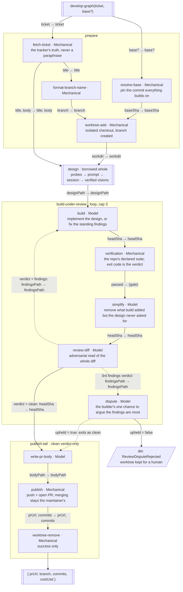

# Graph mermaid vision — envisioning

An ideal imagination exercise, and the first drawing: a graph's ideal shape as a mermaid diagram, imagined as if from nothing — what exists today has no vote. One node per step in the run's data flow, edges as output-to-input field mappings, conditions written on the edges they fire. The failure it prevents: arrows labeled with prose nobody can implement, and diagrams that mirror the current code so faithfully they envision nothing.

The notation itself — what a box, an edge, a condition and a death mean — is spliced in immediately below this document, kept separate so a session drawing from code alone can read the grammar without also being told to draw the ideal, which its own job forbids.

## Do this

- Draw the ideal: nodes and edges may not exist yet — that is the point. The current implementation is banned from the frame.

## Worked example

Gap flagged, not patched: the loop's cap and the verification command are policy, not shape — the diagram names that they exist and leaves their values to configuration.

## Done when

- [ ] The diagram is the drawing itself; surrounding prose only carries what the notation can't.
- [ ] Every edge is a field mapping; every conditional edge names its firing field and value.
- [ ] Every step carries a one-line job and a Mechanical/Model type; borrowed graphs are single boxes.
- [ ] Every death is a terminal stating the error and what survives.
- [ ] Nothing in it mirrors a current file or cites an ID the reader can't resolve from the diagram.
