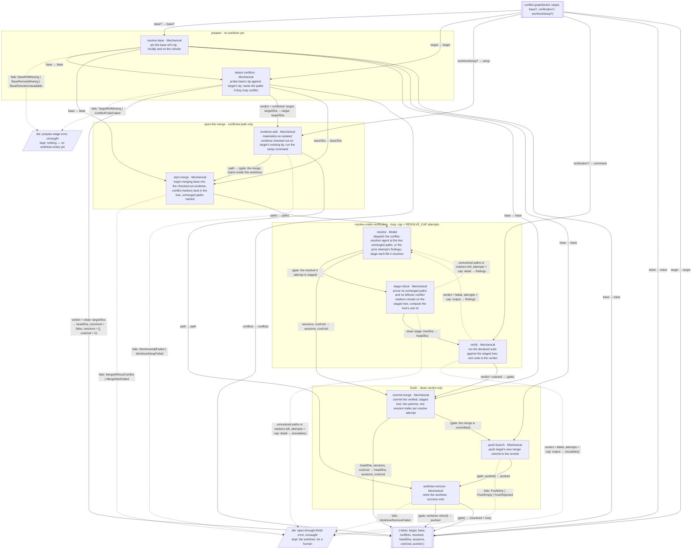

Gaps flagged, not patched:
- `RESOLVE_CAP` (the resolve-loop's attempt bound), the declared verification command's default, and the resolver's hardwired agent/model (`merge-conflict-resolver`, a stronger-than-default model — a resolution with no design and no test to check it against, and picking wrong silently discards someone's work) are policy, not shape — the diagram names `verification?` as an input and leaves the rest to configuration, the same way the sibling develop-graph vision's loop cap does.
- What `findings` carries on a loop-back — `stage-check`'s marker/unmerged detail and `verify`'s suite output are drawn as the same field name, but whether the resolver's next dispatch also needs the prior attempt's own session continued (same conversation) or starts fresh each time is undecided.
- `push-branch`'s rejection is drawn as a death (`PushRejected`), matching the sibling graphs' precedent, but whether a stale local base — the remote moved while this run was resolving — should instead trigger a fresh `detect-conflicts` pass rather than dying is a ruling this vision leaves open.
