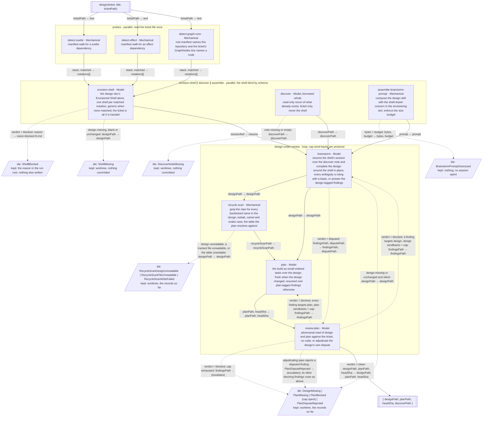

Gaps flagged, not patched:
- The shell pass and the discover session run side by side, so the shell is blind by two mechanisms: its schema cannot name the discover note, and the note is still being written while it draws. Only the schema is the mechanism the graph relies on; the ordering is a wall-clock convenience, and a future graph that ran discover first would still be blind by schema.
- `recycle-scan` reads whatever the design puts in backticks; a design that names nothing in backticks yields an empty table, which the plan cites as an empty prior-art search rather than a failure. Whether an empty scan should die is undecided; the drawing treats it as an answer.
