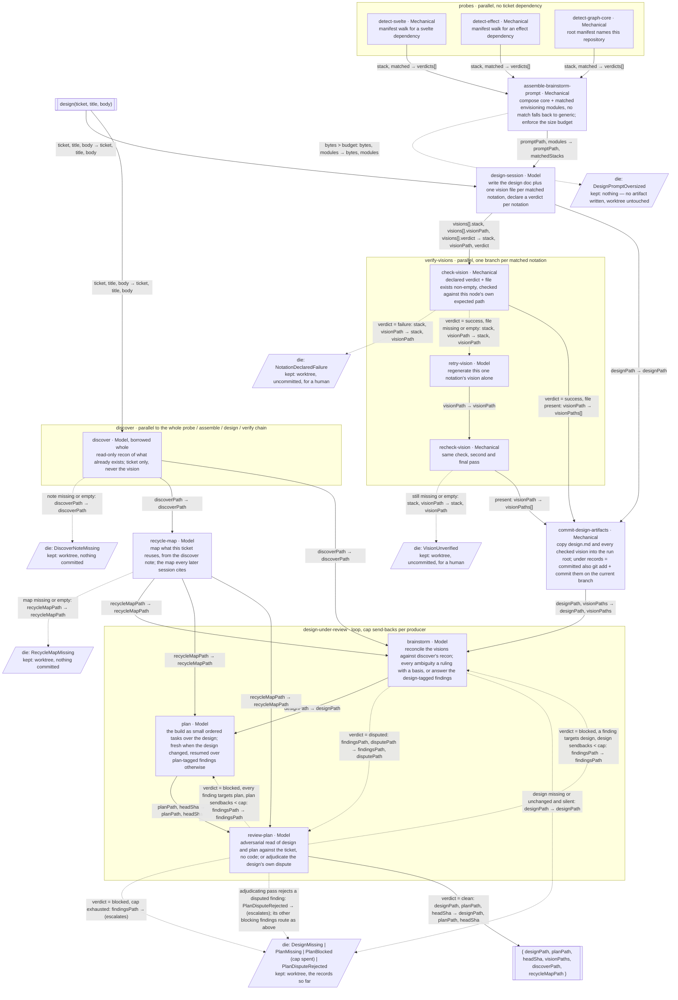

Gaps flagged, not patched:
- One design session writes every matched notation's vision plus the design doc in a single dispatch (this drawing's reading of "one design session") versus "routes ... checked and retried independently of siblings," which reads as one dispatch per notation. Both satisfy the acceptance criteria; which one is real needs a ruling.
- `retry-vision`'s scoped prompt has no named producer: whether it re-enters `assemble-brainstorm-prompt` filtered to the one failing stack, or is composed some other way, is undecided.
- The timing of `NotationDeclaredFailure` is undecided: whether the run waits for every parallel notation branch (checks and retries alike) to resolve before dying, so a human sees every problem at once, or dies as soon as one branch's own siblings-in-flight finish. The requirement guarantees siblings still get their checks, not the exact moment of death.
