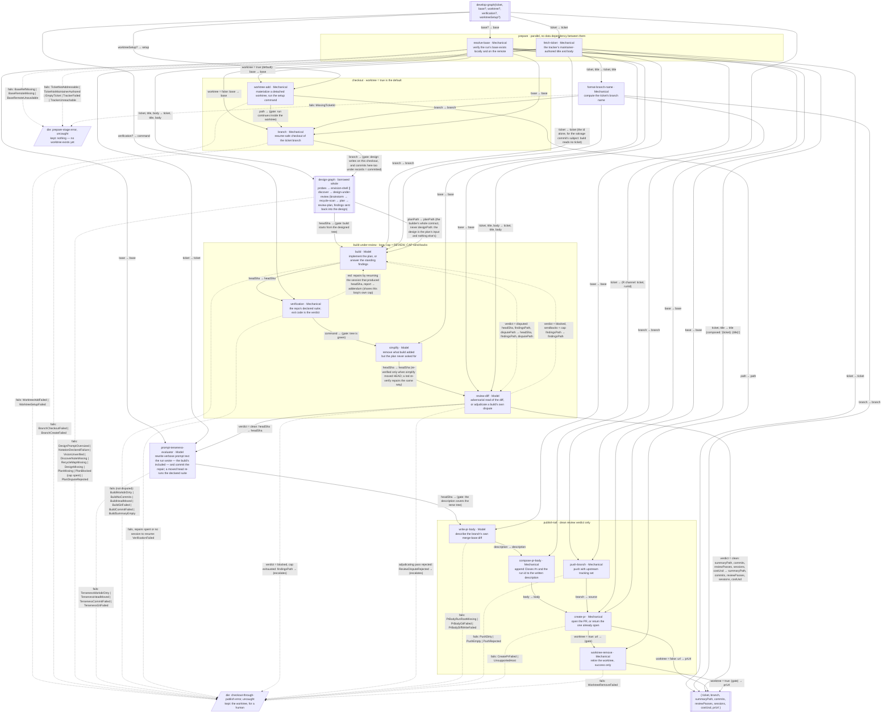

Gaps flagged, not patched:
- `resolve-base`'s `remote`, `fetch-ticket`'s `maintainer`, `publish`'s `host`/`slug`, and the `effect-expert` agent every session dispatches are today's hardwired constants for this repo alone — none of them are fields on `IN`. Running this same drawing against a consuming/generic repo too needs somewhere that repo's own remote, tracker identity, PR host, or build agent come from, and nothing here names it. Whether they join `base`/`verification`/`worktreeSetup` as run inputs, or stay repo-declared policy read from somewhere else, needs a ruling before a second target repo can run this graph.
- `REVIEW_CAP` (the loop's send-back bound), the per-node model assignments (`opus` for design/simplify/review, `sonnet` for build/write-pr-body), and the verification/worktree-setup command defaults are policy, not shape — the diagram names that they exist as inputs to the nodes that use them and leaves their values to configuration, the same way the worked example's loop cap does.
- `design-graph`'s own internal gaps (the single-dispatch-vs-per-notation question, `retry-vision`'s scoped-prompt producer, `NotationDeclaredFailure`'s exact death timing) live in `graphs/design-graph/vision.md` and are not repeated here — this drawing only borrows the box.
