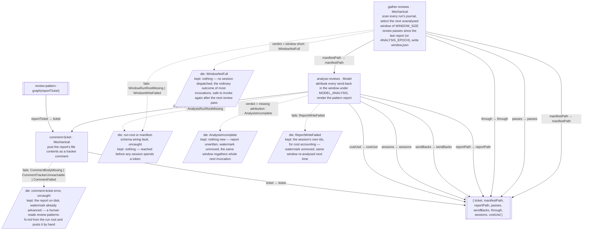

Gaps flagged, not patched:
- `WINDOW_SIZE`, `ANALYSIS_EPOCH` and `MODEL_ANALYSIS` are policy, not shape — the diagram names that `gather-reviews` and `analyse-reviews` read them and leaves their values to the graph file's own constants, the same way `develop-graph`'s `REVIEW_CAP` and per-node models do.
- Nothing produces the field that would fire this graph on its own cadence. `gather-reviews`'s `WindowNotFull` makes invoking the graph free when there is nothing to do, but no node, cron, or launcher in this repo holds the edge "a review pass just ended → invoke `review-pattern-graph`" — today that edge is a person remembering to run `bun run mag review-pattern-graph`, naming the report ticket by hand. Unresolved.
- `WindowNotFull` exits 1 like any other failed run, so a caller chaining on exit status reads "nothing to analyse yet" the same as a real fault. Whether an automatic invoker needs a different signal for that distinction is undecided.
