# `tdd-build` — ideal vision

A ticket-to-PR pipeline where the TDD lane is not a flag on `build-under-review` but the whole
spine: every implementing pass is red-first, every escape the breakers prove gets closed by
routing it back as the next round's only criterion, and only then does the diff face the ordinary
adversarial reviewer. Full granularity: the two composites (`red-green`, `adversarial-review`)
that today hide inside `tdd-build`'s one box are drawn open, alongside every branch, checkout,
worktree and PR step a run touches.

```mermaid
graph TD
  IN[["tdd-build(ticket, base?, worktree?, agent?)"]]
  OUT[["{ prUrl, branch, commits, rounds, escapes, reviewPasses, sessions, costUsd }"]]

  subgraph Prepare["prepare · parallel, then gated join"]
    RB["resolve-base · Mechanical<br/>pin the commit everything builds on"]
    FT["fetch-ticket · Mechanical<br/>the tracker's truth, never a paraphrase"]
    RA["require-acs · Mechanical<br/>refuse a ticket with no acceptance criteria"]
    FBN["format-branch-name · Mechanical"]
  end
  IN -- "base? → base" --> RB
  IN -- "ticket → ticket" --> FT
  FT -- "ticket, title, body → ticket, title, body" --> RA
  RA -. "verdict = missing: ticket, title, headings → dies" .-> DEAD_ACS[/"die: AcceptanceCriteriaMissing<br/>nothing kept — refused before any spend"/]
  FT -- "title → title" --> FBN
  RA -- "criteria → (gate)" --> FBN

  subgraph Checkout["checkout"]
    WA["worktree-add · Mechanical<br/>detached worktree, setup command run"]
    BR["branch · Mechanical<br/>resume-safe checkout of the ticket branch"]
  end
  RB -- "base, sha → base" --> WA
  FBN -- "worktree = true: branch → (gate)" --> WA
  FBN -- "worktree = false: branch → branch" --> BR
  RB -- "base → base" --> BR
  WA -- "path → (kept for worktree-remove)" --> BR

  DISC["discover · Model<br/>read-only recon, a cited note of what the ticket's terrain already holds"]
  FT -- "title, body → title, body" --> DISC
  BR -- "branch → (gate, commits land here)" --> DISC

  subgraph TddLane["TDD lane · loop, cap rounds after the first, spec = acs then the routed escape"]
    TP["test-plan · Model<br/>one red test per behaviour, each naming the bug it catches"]

    subgraph RedGreen["red-green"]
      subgraph RedLoop["red loop · cap send-backs"]
        WR["write-red · Model<br/>write tests red on their own assertion, commit, declare test paths"]
        AR1["assert-red · Mechanical<br/>classify each test path red, green or broken"]
      end
      subgraph GreenLoop["green loop · cap send-backs"]
        IMPL["implement · Model<br/>make tests pass, source only, commit — or dispute a test as wrong"]
        PU["paths-untouched · Mechanical<br/>fail if the range touched a declared test path"]
        AR2["assert-red · Mechanical<br/>classify each test path red, green or broken"]
      end
    end

    VER["verification · Mechanical<br/>run the repo's declared suite"]
    DIFF["diff-since-base · Mechanical<br/>base..HEAD paths not declared as tests"]

    subgraph Adversarial["adversarial-review · breakers dispatched blind, side by side"]
      DJT["detect-js-tests · Mechanical"]
      TS["test-smells · Mechanical<br/>text-decidable flaws, no model session"]
      BRK["break × breakers · Model<br/>one blind breaker claims mutations the tests would miss"]
      VE["verify-escapes · Mechanical<br/>apply each claim, keep what the suite misses and a probe confirms"]
      JS["judge-severity · Model<br/>blind category lookup: severity is a table on the category"]
    end
  end

  DISC -- "discoverPath → discoverPath" --> TP
  TP -- "plan → plan" --> WR
  WR -- "testPaths, redSha → testPaths, sha" --> AR1
  AR1 -. "verdict = green: green, redSha → rewrite addendum" .-> WR
  AR1 -. "verdict = broken: broken, sha → rewrite addendum" .-> WR
  AR1 -- "verdict = all-red: redSha, testPaths → headSha, testPaths" --> IMPL
  AR1 -. "red-loop cap spent: green|broken, redSha → dies" .-> DEAD_REDLOOP[/"die: DeadTestAtBirth | HarnessError<br/>the red commit is kept, for a human to rewrite"/]

  IMPL -- "headSha → toSha" --> PU
  IMPL -. "verdict = dispute: disputePath, headSha → escalates whole" .-> DEAD_DISPUTE[/"die: TestDisputed<br/>disagreement recorded on disk, headSha kept — a human settles it"/]
  PU -- "ok → (gate)" --> AR2
  PU -. "verdict = touched: paths → dies" .-> DEAD_TOUCHED[/"die: PathsTouched<br/>the offending commit range is kept, for a human"/]
  AR2 -. "verdict = stillRed: red, broken, sha → addendum, sessionRef → resume" .-> IMPL
  AR2 -- "verdict = allGreen: headSha → headSha" --> VER
  AR2 -. "green-loop cap spent: red|broken, sha → dies" .-> DEAD_GREENLOOP[/"die: StillRed<br/>the tree is kept mid-fix, for a human to finish"/]

  VER -- "headSha → headSha" --> DIFF
  VER -. "verdict = failed: reportPath → dies" .-> DEAD_TDDVERIFY[/"die: VerificationFailed<br/>reportPath kept — see gap note"/]
  DIFF -- "srcPaths, testPaths → testPaths" --> DJT
  DJT -- "verdict = jsTests: testPaths → testPaths" --> TS
  DIFF -- "srcPaths, testPaths → srcPaths, testPaths" --> BRK
  BRK -- "claims → claims" --> VE
  DIFF -- "command → command" --> VE
  VE -- "escapes → escapes" --> JS

  JS -- "verdict = maxSeverity < 2: rated, plan, smells → rounds" --> SUM["write tdd-build summary · Mechanical<br/>one section per round: plan, escapes, smells"]
  JS -. "verdict = maxSeverity ≥ 2, rounds ≤ cap: worst escape → escapeSpec as next spec" .-> TP
  JS -. "verdict = maxSeverity ≥ 2, rounds > cap: worst, rounds, headSha → dies" .-> DEAD_ESCAPE[/"die: TddBuildEscapeUnresolved<br/>headSha kept, the worst unresolved escape named"/]

  SUM -- "summaryPath, commits, headSha, sessionRef → summaryPath, headSha, producer" --> SIMP

  subgraph OuterReview["outer review · loop, cap send-backs, findings gate the diff a human would merge"]
    SIMP["simplify · Model<br/>reduce the diff to the same behaviour in less code, commit"]
    VER2["verification · Mechanical<br/>re-run the suite, only when simplify moved HEAD"]
    RD["review-diff · Model<br/>adversarial read of the whole diff against the ticket"]
    BRES["build (resume) · Model<br/>resume the implementing session against the findings"]
    BREP["build (resume) · Model<br/>resume the head's own producer against a red report"]
  end

  SIMP -- "headSha, simplified → headSha" --> VER2
  VER2 -. "verdict = failed, repairs ≤ cap, producer known: reportPath → addendum" .-> BREP
  BREP -- "headSha, sessionRef → headSha, producer" --> VER2
  VER2 -. "verdict = failed, cap spent or no producer: reportPath → dies" .-> DEAD_VERIFY2[/"die: VerificationFailed<br/>reportPath kept, for a human to repair by hand"/]
  VER2 -- "verdict = passed or unmoved: headSha → headSha" --> RD

  RD -- "verdict = clean: headSha → headSha" --> TERSE
  RD -. "verdict = findings, sendbacks ≤ cap: findingsPath, headSha, sessionRef → findingsPath, resume" .-> BRES
  BRES -- "headSha, sessionRef → headSha" --> SIMP
  BRES -. "verdict = disputed: disputePath, findingsPath, headSha → adjudicate" .-> RDADJ["review-diff (adjudicating) · Model<br/>re-reviews the same head, carrying the builder's own dispute"]
  RDADJ -- "verdict = clean: headSha → headSha" --> TERSE
  RDADJ -. "verdict = rejected: findingsPath, disputePath, headSha → dies" .-> DEAD_DISPUTEREJ[/"die: ReviewDisputeRejected<br/>the byte-identical tree is kept — a third pass would fabricate a fix"/]
  RD -. "verdict = findings, sendbacks > cap: findingsPath, headSha → dies" .-> DEAD_BLOCKED[/"die: ReviewBlocked<br/>findings kept, headSha kept — cap spent"/]

  TERSE["prompt-terseness-evaluator · Model<br/>rewrite verbose prompt text on the branch as one-liners, commit"]
  TERSE -- "headSha → headSha" --> MOVED{"headSha moved?"}
  MOVED -. "yes: headSha → headSha" .-> VER3["verification · Mechanical<br/>re-run the suite over the terse head"]
  VER3 -- "headSha → headSha" --> WB
  MOVED -- "no: headSha → headSha" --> WB

  subgraph PublishTail["publish-tail · parallel, then joined"]
    WB["write-pr-body · Model<br/>describe the branch's merge-base diff"]
    PB["push-branch · Mechanical"]
    CPR["create-pr · Mechanical<br/>open the PR, return its URL"]
    WR2["worktree-remove · Mechanical<br/>success only, when a worktree was made"]
  end
  WB -- "description → body" --> CPR
  PB -- "branch → source" --> CPR
  CPR -- "url → (gate)" --> WR2
  WR2 --> OUT
```

## Gaps

- **The TDD lane's own `verification` (the box before `diff-since-base`) has no repair loop.**
  `red-green` only proves the declared test paths green; the whole-suite run can still fail for an
  unrelated reason, and today that death is immediate — no resumed session gets a chance to fix it,
  unlike the symmetric repair loop drawn around the outer review's `verification`. Whether that
  asymmetry is intentional (a red whole-suite result this early is a wiring problem, not a
  findings-shaped one) or a missing repair pass is a ruling this diagram surfaces but does not make.
- **`rounds`, `escapes` and `reviewPasses` reaching `OUT`** assumes the ideal carries them the whole
  way rather than dropping them at the `SUM → OuterReview` boundary the way today's `BuiltPass`
  mapping does; that is this vision's own choice, not a fact read off any code.
- **The loop caps** (`TddLane`'s round cap, `RedLoop`/`GreenLoop`'s send-back caps, `OuterReview`'s
  send-back cap, `breakers` and its claim budget) and the two commands (`command`, the per-path
  `testCommand`) are policy values, not shape — this diagram names that they exist and leaves their
  numbers to configuration, exactly as `develop-graph`'s `REVIEW_CAP` does today.
